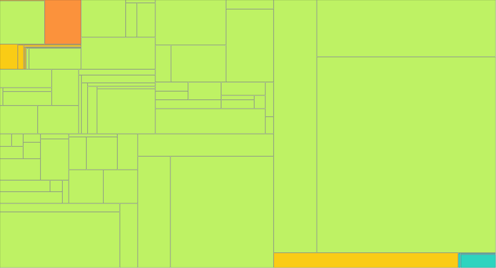

# BioHazard V Resurrection

From-scratch Resident Evil 5 PC 1.1.0 Dev decompilation/reimplementation project, organized around a canonical binary inventory and real C/C++ source recovery.

> **Foundation and Inventory are validated. The current V6 full-scan candidate baseline contains 79,782 potential function starts. V5's 79,016 fixed-point set is retained as the stricter high-confidence cross-check. Ordered decompilation is active in Phase 14 with one coordinator.**

## Progress

<!-- progress:start -->
```
Functions   ░░░░░░░░░░░░░░░░░░░░░░░░░░░░░░    0.0%  20 / 79,782
Code size   ░░░░░░░░░░░░░░░░░░░░░░░░░░░░░░    0.0%  920 / 15,568,343
```
<!-- progress:end -->

The tiers below are independent dimensions. A function can eventually be MATCHED without yet being fully CONVERTED/readable, or CONVERTED before exact matching is available.

<!-- tiers:start -->
```
FAST PASS  ░░░░░░░░░░░░░░░░░░░░░░░░░░░░░░    0.0%  19 / 79,782
CONVERTED  ░░░░░░░░░░░░░░░░░░░░░░░░░░░░░░    0.0%  4 / 79,782
REFINED    ░░░░░░░░░░░░░░░░░░░░░░░░░░░░░░    0.0%  0 / 79,782
VERIFIED   ░░░░░░░░░░░░░░░░░░░░░░░░░░░░░░    0.0%  0 / 79,782
MATCHED    ░░░░░░░░░░░░░░░░░░░░░░░░░░░░░░    0.0%  0 / 79,782
LINKED     ░░░░░░░░░░░░░░░░░░░░░░░░░░░░░░    0.0%  0 / 79,782
```
<!-- tiers:end -->

The public denominator is now the **79,782-entry broader candidate universe** reconstructed from the exact target. It is not presented as a mathematically exact original C/C++ source-symbol count: the PE has no authoritative all-function symbol table and the matching `BH5DCRelease.pdb`/MAP is unavailable. The previous **79,016** V5 fixed-point CFG set remains recorded as a stricter high-confidence subset.

## Progress atlas

The atlas is driven from canonical metadata. Inventoried-but-unimplemented code starts gray; recovered functions change color only when their corresponding tier/status evidence exists.



[Interactive Progress Atlas](reports/index.html)

### Color meaning

- dark green — MATCHED
- green — VERIFIED
- light green — REFINED
- teal — CONVERTED
- yellow-green — FAST_PASS_VALIDATED
- yellow — FAST_PASS
- orange — DISASSEMBLED / DISCOVERED
- red — BLOCKED
- gray — UNSEEN

## Inventory baseline

- Target SHA-256 — `323d1aabccc74505745588097e2b298b14e114393bfc24f6830e98b658e67815`
- V6 broader potential-function-start universe — **79,782**
- V5 fixed-point high-confidence cross-check — **79,016**
- Difference pool retained for classification — **766** candidates (**0.97%**)
- Independent full `.text` linear-scan rows — **4,837,889**
- Direct `CALL` targets — **19,195**
- Targets in aligned sequences of ≥2 code pointers — **40,912**
- 16-byte-aligned starts after ≥2 `INT3`/`NOP` padding bytes — **69,076**
- Complete raw file bytes accounted — **19,977,216 / 19,977,216**
- MSVC RTTI TypeDescriptors — **433**
- CompleteObjectLocators — **494**
- Confirmed structural MSVC vtables — **494**
- Vtable slots — **3,534**
- Imports — **376 across 21 DLLs**
- Exports — **0**

See [`config/inventory_freeze.json`](config/inventory_freeze.json), [`reports/function-count-audit.md`](reports/function-count-audit.md), [`reports/full-executable-reaudit-v4.md`](reports/full-executable-reaudit-v4.md), and [`reports/full-executable-reaudit-v5.md`](reports/full-executable-reaudit-v5.md).

## Roadmap state

- Foundation — ✅ PASS
- Binary / Function / XREF / RTTI / Global Inventory — ✅ PASS
- Inventory V6 candidate baseline — ✅ **79,782**
- Pilot Fast Pass / ordered decompilation — 🟡 ACTIVE
- Multi-agent Scale — 🔒 LOCKED

## What matching means

The exact PC/x86 MATCHED criterion will be refined during Pilot from reproducible function-level evidence. No function is marked MATCHED merely because its address or pseudocode is known.

## Build

```sh
cmake --preset dev
cmake --build --preset dev
ctest --preset dev
```

## Setup

The target executable is supplied locally by the user and remains git-ignored. Original EXEs, DLLs and game assets are never committed.

## Coordination

One coordinator owns Pilot. Parallel work remains disabled until the full Pilot pipeline passes its gate. Development branches do not publish this dashboard; the public dashboard exists only on `main`.

## Legal and scope

This repository contains original source, tooling, metadata and documentation. Proprietary game binaries/assets remain local.
